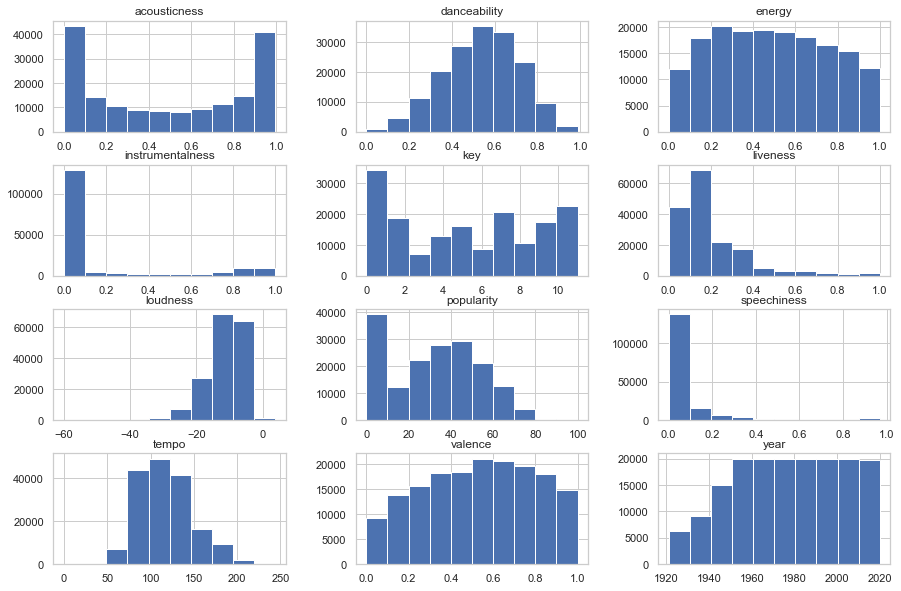
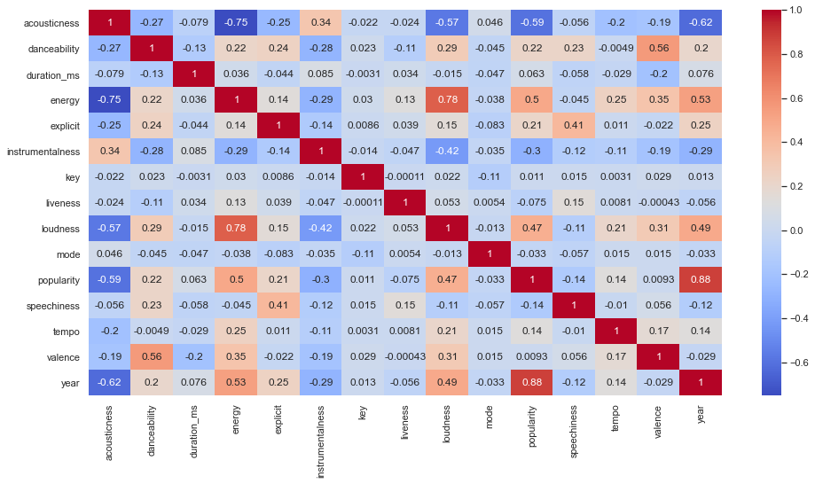

# Midterm Report
### Megan Yin (my474), Fionna Chen (fyc3)

## The Data

### Tables
The Spotify dataset contains 5 tables on song data:
1. `data.csv` contains more than 160,000 songs collected from the [Spotify Web API](https://developer.spotify.com/documentation/web-api/)
2. `data_by_artist.csv` groups this information in `data.csv` by artist
3. `data_by_genres.csv` groups by genres
4. `data_by_year` groups by year
5. `data_w_genres.csv` adds the genre information for each song

### Features

In this dataset we have 19 features and 169,909 examples. We have numerical, boolean, and categorical features described below.

<small> Descriptions based on [Audio Features](https://developer.spotify.com/documentation/web-api/reference/tracks/get-audio-features/) in [Spotify Web API](https://developer.spotify.com/documentation/web-api/) </small>

#### Numerical
* acousticness (0.0-1.0): A confidence measure of whether the track is acoustic. 
* danceability (0.0-1.0): describes how suitable a track is for dancing based on a combination of musical elements including tempo, rhythm stability, beat strength, and overall regularity. 
* energy (0.0-1.0): represents a perceptual measure of intensity and activity. Typically, energetic tracks feel fast, loud, and noisy. For example, death metal has high energy, while a Bach prelude scores low on the scale. Perceptual features contributing to this attribute include dynamic range, perceived loudness, timbre, onset rate, and general entropy. 
* duration_ms (int): duration of track in milliseconds
* instrumentalness (0.0-1.0): Predicts whether a track contains no vocals. “Ooh” and “aah” sounds are treated as instrumental in this context. Rap or spoken word tracks are clearly “vocal”. The closer the instrumentalness value is to 1.0, the greater likelihood the track contains no vocal content. _Values above 0.5 are intended to represent instrumental tracks_, but confidence is higher as the value approaches 1.0.
* valence (0.0-1.0): describing the musical positiveness conveyed by a track. Tracks with high valence sound more positive (e.g. happy, cheerful, euphoric), while tracks with low valence sound more negative (e.g. sad, depressed, angry). 
* popularity (0-100, int): measure of how popular a song is. 0 very unpopular, 100 very popular.
* tempo (float): The overall estimated tempo of a track in beats per minute (BPM). In musical terminology, tempo is the speed or pace of a given piece and derives directly from the average beat duration.
* liveness (0.0-1.0): Detects the presence of an audience in the recording. Higher liveness values represent an increased probability that the track was performed live. _A value above 0.8 provides strong likelihood that the track is live._
* loudness (float): The overall loudness of a track in decibels (dB). Loudness values are averaged across the entire track and are useful for comparing relative loudness of tracks. Loudness is the quality of a sound that is the primary psychological correlate of physical strength (amplitude). Values typical range between -60 and 0 db.
* Speechiness (float): detects the presence of spoken words in a track. The more exclusively speech-like the recording (e.g. talk show, audio book, poetry), the closer to 1.0 the attribute value. Values above 0.66 describe tracks that are probably made entirely of spoken words. Values between 0.33 and 0.66 describe tracks that may contain both music and speech, either in sections or layered, including such cases as rap music. Values below 0.33 most likely represent music and other non-speech-like tracks.
* year (1921-2020): year the song was released

#### Boolean
* mode: 0 = minor, 1 = major
* explicit: 0 = no explicit content, 1 = explicit content

#### Categorical
* key (int): The estimated overall key of the track. Integers map to pitches using standard [Pitch Class notation](https://en.wikipedia.org/wiki/Pitch_class). E.g. 0 = C, 1 = C♯/D♭, 2 = D, and so on. If no key was detected, the value is -1.
* artists (string[]): list of artists on the track
* release_date (yyyy-mm-dd): release date of the track (precision varies)
* name (string): name of the song

### Histograms
We wanted to get a sense of the distribution of our data on some of these (numerical) features so we used the pandas `Dataframe.hist` function to plot histograms of key features.

Observations:
* acousticness: we usually have high confidence on whether a track is acoustic or not. (Most tracks are in the 0-0.1 or 0.9-1.0 range of acousticness). If these acousticness scores are accurate, we have about an equal distribution of acoustic vs. not acoustic tracks
* danceability: this metric is pretty normally distributed across songs (but perhaps with a heavier left tail). Most songs are moderately danceable (mid-valued), with very few songs on the extremes.
* energy: the data is relatively equally distributed on energy values
* instrumentalness: We mostly have non-instrumental songs since the histogram shows most songs around 0.0-0.1 instrumentalness.
* key: we have a good distribution of keys with relatively more of them in the 0th key of C
* liveness: most of our songs are not live (don't have an audience component).
* loudness: most songs are not loud with a loudness value close to 0. However, we do have some songs that are very loud. We have very few in the mid-range, though.
* popularity: most songs have popularities in 0-80 range with relatively higher density in 0-10 range meaning very unpopular. This makes sense because relatively few songs are very popular; most songs are niche and unpopular.
* speechiness: Most of our songs are not speechy, although we do have some speechy ones that may be raps or something. We can probably check the very speechy ones to make sure they are still songs and not audio files of a talk show or podcast.
* tempo: We don't have any very slow songs (tempos are all > 50). Tempos are normally distributed with some very fast songs.
* valence: also rather normally distributed which means we have a variety of moods present in the dataset.
* year: we consistently have 2000 songs for every year after around 1950. Before then, the number of songs for each year was increasing. 

## Corr Plot

We see the features most strongly correlated with popularity are year, energy, loudness, and acousticness. Energy, loudness, and acoustic make sense since pop songs tend to be very upbeat and loud (makes for a better concert experience). However, year is surprising. This may indicate some bias in our data that for more recent years, so many songs get released only the most popular are included in this dataset. As we train our model, we should keep these key features in mind especially as we try to train a sparse model.

## Missing Values
We're lucky to not have any missing values in this dataset. This is likely because the data comes from the Spotify API directly and we limit ourselves to only songs from there. Thus any songs Spotify has would have all of these features defined and outputted in the API.

## Feature Transformations
The `artist` feature column is a list of artists on that track. The elements of that list are strings with the names of the artist. We can encode this in a many hot encoding such that a $1$ in column $i$ means artist $i$ is featured on that track. This can be interesting for us to predict popularity or see how certain artists have gotten more popular over time. Certainly, we have seen the artist has a huge effect on the popularity of a song which is why smaller artists try to work on songs with more popular artists.

We also have a textual feature on the name of the song. Certain words in the song may be indicators that it will be very popular. We may consider assigning weights to certain words if they appear in the song name. Words like 'Symphony' could indicate the type of song as well. 

Most other features have already been scaled and normalized for us on a 0-1 scale fortunately so we should be fine to use the raw data. Perhaps to reduce noise, we may consider changing some of these values to boolean. This may also help overfitting. 

## Over and Underfitting
If we were to just use the 19 features as is we run a risk of underfitting the model since there are just too few features to capture the 160k+ examples. However, we will expand the artists feature to a many-hot encoded vector representing artists on the track. This will drastically increase the number of features, but this is still a sparse matrix. 

Other ways to avoid underfitting is by fitting a more complex model. For example, we can experiment with various forms of Polynomial Regression or random forest/SVM regressions.

To prevent overfitting, we should separate our data into the 80/20 train test set split. We will also look into applying 10-fold cross validation. 

## Naive Regressions
We wanted to get a sense of how our model would perform if we just trained models on the numeric data to predict popularity. This can give us a baseline of how our model would do (so we know how to do better) and what models might work better/be prone to overfitting.

|                                    | Training Mean Squared Error | Test Mean Squared Error |
|------------------------------------|-----------------------------|-------------------------|
| Linear Model                       | 101.82                      | 100.03                  |
| Ridge Regression                   | 101.82                      | 100.03                  |
| Polynomial Regression (degree=2)   | 98.01                       | 96.30                   |
| Nearest Neighbors Regression (n=5) | 52.99                       | 81.71                   |
| Decision Tree Regression           | 0.69                        | 77.08                   |
| Lasso Regression                   | 102.86                      | 101.72                  |

Observations:

* Linear Model, Ridge Regression, and Lasso Regression basically produce the same results. This makes sense since they're the same underlying objective (least squares) with different regularizers which seem to not make too much difference here. We could, however, investigate how changing the regularization terms can affect the results.
* Polynomial Regression helps a little bit which there may be some polynomial relationships here worth investigating. We will continue to explore whether changing the degree can drastically improve prediction accuracy. 
* Nearest Neighbor Regression has much better training error but over fits on the test set. Nearest Neighbor seems more natural to find clustering of related songs and predict popularity based on neighboring similar songs. We can experiment with more clusters but that may worsen overfitting. We can also try to dissect what the clusters mean.
* Decision Tree Regression has the best training error but seems to achieve that by memorizing the dataset. This is a very complex model and may be too complex for our purposes.

Generally we see from these models that underfitting is the first problem. We may need to find more and better features to supplement our model. However, we have to keep in mind overfitting and not make our model too complex.

## Semester Plan

Now that we've explored our data, we can begin to think about how to apply better feature transformations and choose better models to make better predictions on popularity. Here are some ideas we're excited to explore further:

* apply many hot encoding feature transformation on `artists` feature
* many of our data is real valued from 0.0-1.0 which may be too much granularity. Maybe we can consider which we can turn into boolean values instead (since the value is just a confidence measure).
* look into splitting dataset by year to still predict population, but now we can see what trends exist yearly. This will reduce the noise in our dataset since songs and tastes from 1921 vs 2020 are very different. 
  * we may use one of the Naive Regressions as a baseline but consider how we can tune parameters or do better regularization 
  * when choosing our model we should prefer sparse models (e.g. Lasso/Non-negative least squares) to reduce the complexity of the model
* apply k-means clustering to see if we can identify songs of similar artists
* Perhaps we can turn popularity into a boolean value and just predict whether a song will be a hit or not?

